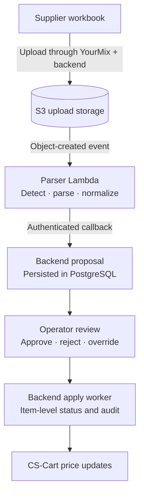
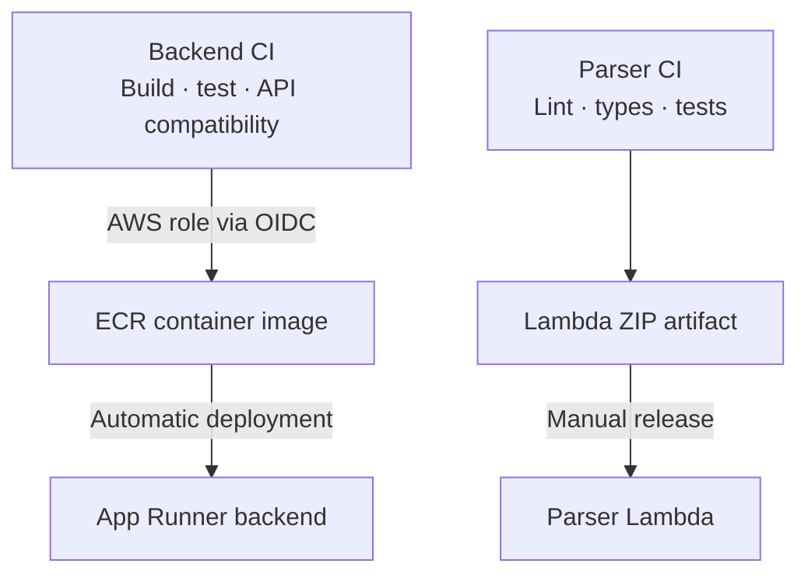

# Architecture

YMart connects existing business systems through a modular application core, asynchronous ingestion and an operator-facing workflow. The design keeps integration complexity behind explicit boundaries while making business decisions and their outcomes visible.

## Application boundaries

**Acumatica owns ERP records; CS-Cart owns the storefront; YMart owns the workflow.** PostgreSQL stores proposals, audit history and local catalogue projections. The operations UI talks to the backend rather than handling business-system credentials or orchestrating integrations itself.

The Kotlin/Spring Boot backend is a **Spring Modulith modular monolith**. Catalogue, pricing, logistics and shared platform services have declared dependencies; ArchUnit checks layer separation and Modulith verifies module boundaries and cycles. Ports isolate domain services from persistence and external HTTP adapters.

One backend deployment keeps delivery and operation proportionate to the system. Parsing gets a separate runtime for a distinct workload and dependencies, rather than creating a service for every business module.

## Integration engineering

External APIs are treated as boundaries to validate, not abstractions to trust blindly:

- **Storefront compatibility:** the product adapter works around a failing single-product endpoint using a filtered lookup, then verifies the returned product ID. Ambiguous SKU matches are rejected rather than silently choosing a product.
- **ERP connectivity:** session handling stays in the backend client; a regional proxy accommodates the ERP host's South African network-access constraint.
- **Local read model:** scheduled catalogue synchronization maintains PostgreSQL projections, tracks freshness and failures, and keeps operational queries independent of individual storefront requests.
- **Contract evolution:** backend CI checks OpenAPI compatibility; frontend CI checks generated types against the committed contract.

This concentrates vendor-specific behaviour in adapters while keeping business rules and the frontend stable.

## From supplier file to storefront update

The TypeScript parser detects workbook formats and normalizes supplier rows. S3 decouples file receipt from processing; the frontend follows progress through polling instead of holding a long-running request open.

**Approval and application are separate state transitions.** Proposal items retain current and proposed values, overrides and update outcomes. The worker records partial success and individual failures, with retry and revert paths. Reverts compensate for prior writes; they cannot roll back PostgreSQL and CS-Cart as one transaction.

## Infrastructure and delivery

Terraform defines the application environment:

- **Compute:** App Runner for the containerized backend; Lambda for file parsing; EC2 for regional ERP connectivity.
- **Data:** RDS PostgreSQL and versioned, encrypted S3 upload storage, with event notifications connecting ingestion to the parser.
- **Identity:** runtime IAM roles and GitHub Actions OIDC federation for backend deployment, avoiding stored AWS deployment access keys.
- **Operations:** CloudWatch logging, Grafana/Loki integration and provisioned dashboards.

Liquibase owns schema evolution. Terraform owns infrastructure and event wiring; application pipelines produce the deployable artifacts.

Backend CI builds against PostgreSQL before publishing images. Frontend CI checks generated API types, lint, TypeScript, tests and the production build. Parser CI verifies format handling and produces the Lambda package.

The current delivery model uses App Runner auto-deployment from `latest` and a manual parser release. Immutable promotion is a natural next step without changing the application architecture.

## Verification and observability

Verification spans domain behaviour, PostgreSQL integration, external HTTP adapters, module boundaries, parser formats and frontend workflows. Vitest/MSW isolate frontend behaviour; Playwright exercises the browser against a configured backend.

Backend health endpoints and structured logs, parser CloudWatch logs, Grafana/Loki views and frontend Sentry instrumentation cover different failure surfaces. Catalogue synchronization additionally tracks last-success state and consecutive failures, connecting integration health to data freshness.

## Frontend structure

[Routes](src/router.tsx) expose inventory, catalogue, pricing and proposal review. [Query hooks](src/hooks/queries) manage server state and polling; the [proposal service](src/services/bff/proposals.ts) maps the business workflow to the API. A [shared client](src/services/api-client.ts) applies authentication and error handling against [generated OpenAPI types](src/generated/openapi.json).

TanStack Query owns server state, TanStack Table owns table state, React context owns authentication, and component state owns local interactions. This separates business progress from transient UI state.

## Operational trade-offs

The architecture targets supervised operations with a small deployment footprint. The next hardening priorities are idempotent commands, concurrent-worker recovery, stronger access isolation and verified restore procedures, rather than additional services. Retries, audit records and module boundaries are useful building blocks; end-to-end recovery remains a separate engineering responsibility.
