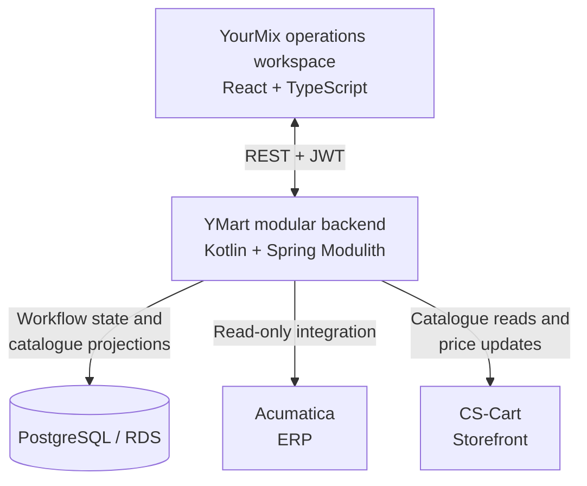

# YMart: operations platform architecture

Supplier price lists need review before they become storefront updates, and approval is not the same as a successful external write. YMart makes that process explicit: ingest a workbook, review proposed changes, apply approved items and inspect the outcome of each write.

I am [Artem Polovyi](https://github.com/apolovyi), the platform's designer and developer. My work spans application architecture, backend integrations, the YourMix operations workspace, asynchronous ingestion, infrastructure and delivery. The ERP and storefront retain ownership of their records; YMart owns the workflow between them.

## Engineering decisions

- **Explicit boundaries without a deployment per module.** I chose a modular monolith with declared module dependencies and ports/adapters. Spring Modulith and ArchUnit check the boundaries, while one backend deployment keeps the operational footprint proportionate to the application.
- **Separate business decisions from external outcomes.** Approval and application are different state transitions. Items retain old and proposed values, overrides, audit records and write outcomes, making partial success and individual failures inspectable rather than treating the workflow as a single batch write. Retry and compensating revert paths operate on those recorded outcomes.
- **Isolate file processing as a distinct workload.** S3 decouples upload from parsing; a Lambda detects workbook formats and normalizes rows into backend proposals. Operators follow processing status without holding a long-running upload request open. Parsing has its own runtime because its workload and dependencies differ from the application core.
- **Keep operational queries independent of vendor requests.** Local catalogue projections support filtering and quality inspection without a storefront round trip for every interaction, with synchronization freshness and failures tracked explicitly. Integration adapters handle endpoint defects, verify returned product identities and reject ambiguous matches rather than silently selecting a product.
- **Design delivery alongside the application.** Infrastructure definitions, database migrations, API compatibility checks and generated frontend contracts connect changes across layers. Deployment uses AWS OIDC federation; logs and synchronization health expose different failure surfaces. The architecture case study describes the actual deployment paths and their trade-offs.

[Read the architecture case study](ARCHITECTURE.md) for application boundaries, ERP connectivity, ingestion, infrastructure and operational trade-offs.

## System design

The implementation combines a Kotlin/Spring backend, PostgreSQL, a React operations workspace, TypeScript ingestion and Terraform-managed AWS.



Supplier files flow through S3, the parser Lambda and backend proposals. The backend runs on AWS App Runner, with container delivery through GitHub Actions and ECR.

## Explore the implementation

The YourMix frontend brings the workflow together: workbook upload, processing status, proposal review, overrides, catalogue filtering and product-health inspection.

- [Proposal integration](src/services/bff/proposals.ts) — upload, review and application status.
- [Typed API client](src/services/api-client.ts) — generated contracts, authentication and error handling.
- [Query hooks](src/hooks/queries) — server state, polling and cache invalidation.
- [Shared data table](src/components/ui/DataTable.tsx) — reusable operations-table behaviour.
- [Tests](src/test) — service and component verification with Vitest and MSW.

## Local development

Use Node.js 22 and pnpm 10.28.2. Application screens require a compatible backend and login; configure `VITE_API_URL` in `.env.local` using [.env.example](.env.example).

```bash
pnpm install --frozen-lockfile
pnpm dev
```

The frontend runs on port **3050**. MSW is used in tests; the `/ai` route is a placeholder. Sentry is optional through `VITE_SENTRY_DSN`.

```bash
pnpm typecheck
pnpm lint
pnpm test:run
pnpm build
```

[Playwright E2E tests](e2e) default to a local backend. Set `E2E_BACKEND`, `E2E_EMAIL` and `E2E_PASSWORD` in `.env.e2e.local` to use another test environment.
