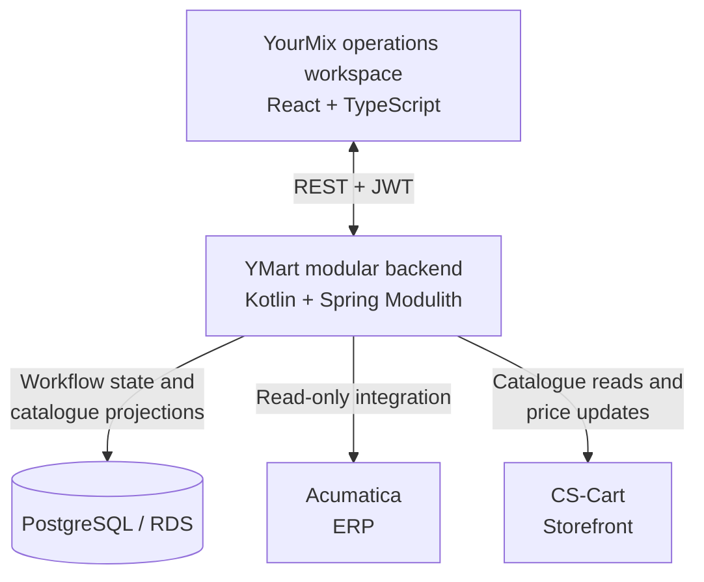

# YMart · Operations platform

**System architecture, full-stack engineering and AWS delivery.**

I designed and built an operations platform connecting supplier spreadsheets, a distribution ERP and an e-commerce storefront. It turns incoming price lists into reviewable proposals, exposes catalogue quality issues and tracks price changes through approval and application.

The work spans Kotlin/Spring backend services, a React operations workspace, asynchronous ingestion, Terraform infrastructure, CI/CD and observability.

## System design



Supplier files flow through **S3 → TypeScript Lambda → backend proposals**. The backend runs on AWS App Runner, with infrastructure managed through Terraform and container delivery through GitHub Actions and ECR.

## Engineering decisions

- **Modular monolith over microservices.** Business modules and ports/adapters give the backend explicit, testable boundaries without multiplying deployments. Spring Modulith and ArchUnit check those boundaries.
- **Integration beyond API wrappers.** Adapters handle storefront API defects, verify returned product identities and isolate ERP session handling. A regional proxy addresses the ERP's connectivity constraint.
- **Workflows rather than blind batch writes.** Pricing separates review decisions from application outcomes, retaining old values, item-level failures, audit records, retries and compensating reverts.
- **Local projections for operational queries.** Catalogue data is synchronized into PostgreSQL so filtering and analysis do not require a storefront round trip for every interaction.
- **Delivery designed alongside the application.** OpenAPI compatibility checks, generated frontend types, database migrations, AWS OIDC authentication and centralized logs connect development to operation.

[Read the architecture case study](ARCHITECTURE.md) for the ingestion flow, infrastructure, delivery paths and trade-offs.

## Explore the implementation

The YourMix frontend brings the workflow together: workbook upload, processing status, proposal review, overrides, catalogue filtering and product-health inspection.

- [Proposal integration](src/services/bff/proposals.ts) — upload, review and application status.
- [Typed API client](src/services/api-client.ts) — generated contracts, authentication and error handling.
- [Query hooks](src/hooks/queries) — server state, polling and cache invalidation.
- [Shared data table](src/components/ui/DataTable.tsx) — reusable operations-table behaviour.
- [Tests](src/test) — service and component verification with Vitest and MSW.

## Local development

Use Node.js 22 and pnpm 10.28.2. Application screens require a compatible backend and login; configure `VITE_API_URL` in `.env.local` using [.env.example](.env.example).

```bash
pnpm install --frozen-lockfile
pnpm dev
```

The frontend runs on port **3050**. MSW is used in tests; the `/ai` route is a placeholder. Sentry is optional through `VITE_SENTRY_DSN`.

```bash
pnpm typecheck
pnpm lint
pnpm test:run
pnpm build
```

[Playwright E2E tests](e2e) default to a local backend. Set `E2E_BACKEND`, `E2E_EMAIL` and `E2E_PASSWORD` in `.env.e2e.local` to use another test environment.
